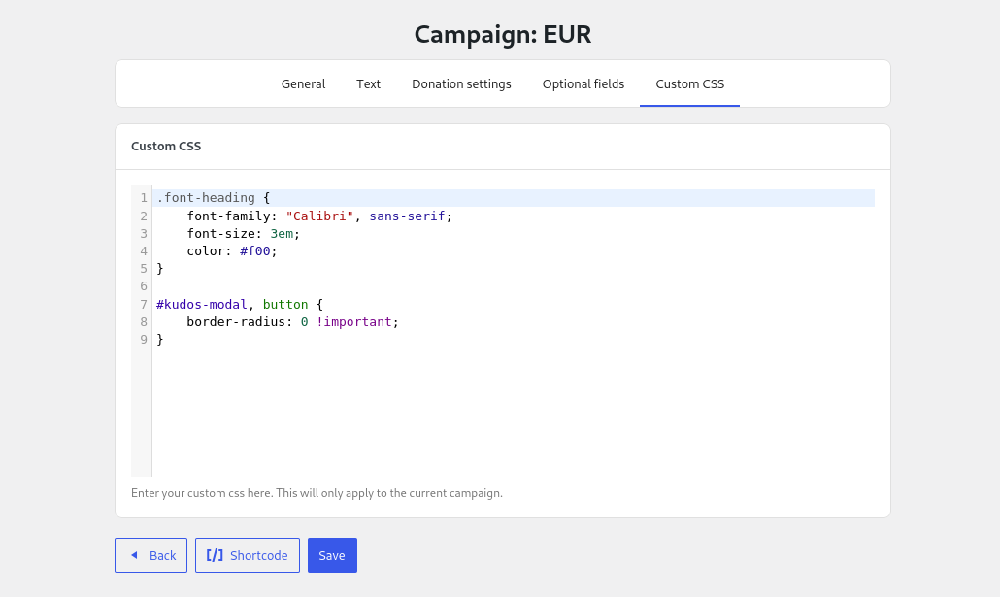

# Custom CSS

Mainly for advanced users, this section allows you to customise the Cascading Style Sheets (CSS) used for the current campaign.

---



:::info

Remember: These customisations will only apply to Kudos Donations and the current campaign.

:::

Here are a few examples of some customizations you can make:

```css title=""
/* Change title font for all sections. */
h2.title {
    font-family: "Times New Roman",serif;
}

/* Change title font only for the Summary section. */
.section-summary h2.title {
    font-family: "Droid Sans", serif;
}

/* Change color of body text */
.body {
    color: #205d3b;
}

/* Make form buttons square */
form .button {
    border-radius: 0;
}

/* Make all inputs squared (not rounded) */
.field .control,
.field .control span {
    border-radius: 0;
}
```