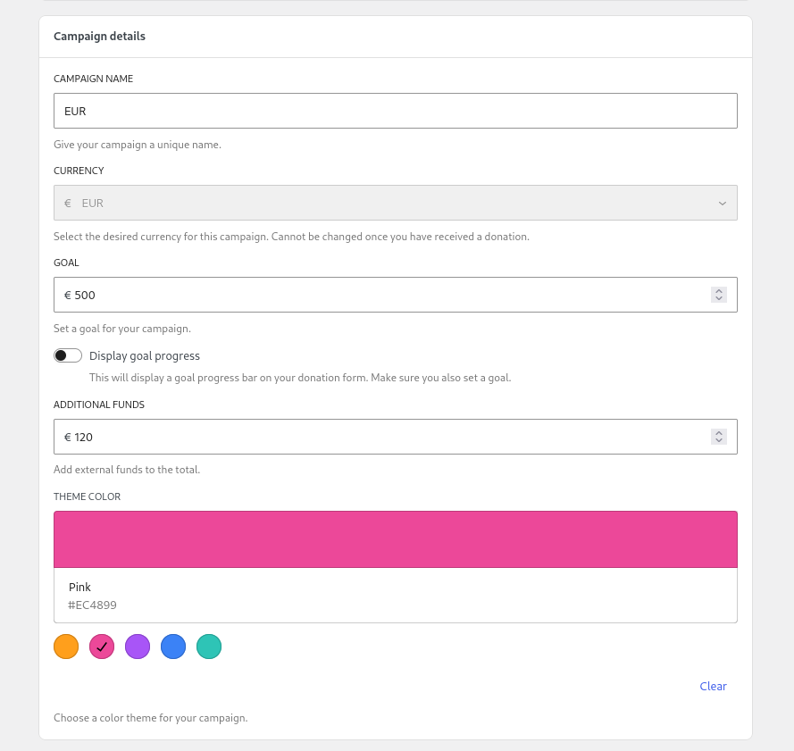
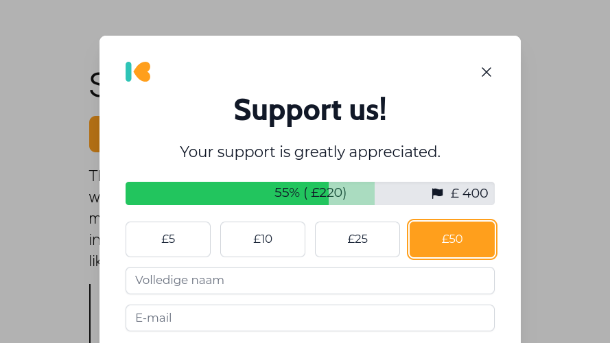
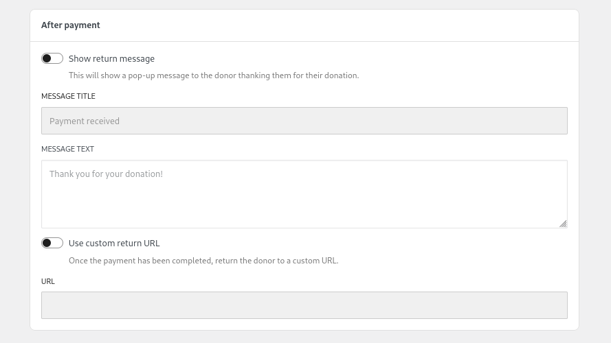
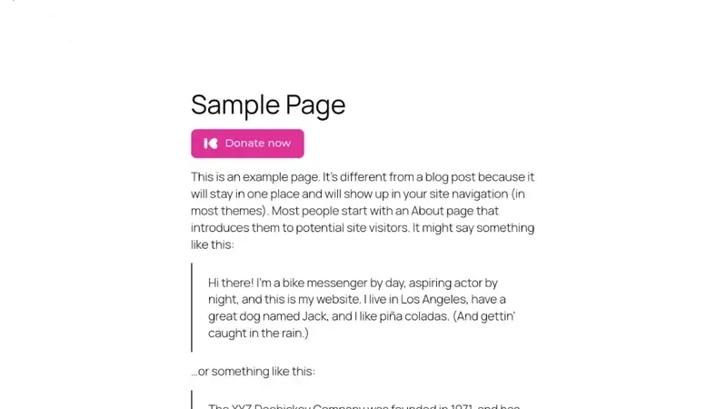

# General

The **General** tab contains some of the more generic settings for your campaign; such as the name, goal, theme colour and what happens once the donor has completed the payment.

---

## Campaign details

### Campaign name

The campaign name is used for identifying your campaign throughout the plugin. With the default settings, this is not visible to the public.

### Currency

This indicates the currency that donations will be made in and is currently dictated by those [supported by Mollie](https://docs.mollie.com/docs/multicurrency).

:::note

Once you have received a donation it will no longer be possible to change the currency and the option will be greyed out.

:::

:::note

Not all currencies are supported by all payment methods.

:::

### Goal

The goal is used help track the progress of your campaign, both in the campaign overview page and publicly (see [Display Goal Progress](#display-goal-progress) below).

### Display Goal Progress

When enabled this will publicly display the progress of your campaign at the top of any associated donation forms.

### Additional Funds

This is a way of increasing the total for the campaign with donations that may have been made outside of Kudos Donations. Mainly useful for when **Display Goal Progress** is enabled.

### Theme Color

The theme colour option allows you to either select from a palette of colours or a custom colour (by clicking on the large colour bar). This will determine the overall theme colour for this campaign which effects the buttons, selected input boxes, selected donation amount etc.

## After payment

Once the donor has completed the payment with the payment provider they will be returned to your website. By default thy will be returned to the same page the donation form was on. The settings below allow you to both enable a thank you pop-up and/or send them to a different page.

### Show return message

The return message is a pop-up that will appear to thanks the donor and let them know that their donation has been received successfully (or not if there was a problem).

#### Message Title

This will be the title for the return message pop-up.

#### Message Text

This will be the content for the return message pop-up.

### Use custom return URL

Enable the use of a custom URL for your donors to be sent to after donating. For example, instead of returning to your donation page you can create a custom thank you page that they will be sent to after donating.

#### URL

Here you can set a custom URL for your donor to be sent to after donating.