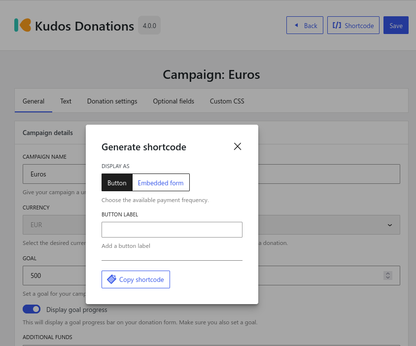

# Changes in v4.0.0

## Introduction

Version 4.0.0 is a major upgrade to Kudos Donations. The plugin has been re-written from the ground up and contains a number of notable changes and improvements compared to the 3.x versions.

Among the many changes available, the most notable ones are that most settings are now set at the campaign level (as opposed to being global) and the the front end of the plugin is now rendered in a separate frame using React.

:::warning

If you have made customizations to Kudos Donations using CSS, these will need to be reconfigured. Please read [here](#react-front-end) for more information.

:::

:::info

**Developers**: All entities (Transactions, Campaigns, Donors etc.) are now **Custom Post Types** instead of custom tables/options. This means they will integrate better with third-party plugins (e.g Export or Backup plugins).

:::

## Overview

Here is a quick overview of the major changes:

* New campaigns admin page with ability to create / edit / duplicate and delete campaigns
* Can now configure most settings per-campaign rather than globally
* Complete rewrite of front-end rendering to react
* Reduced conflict with other themes and plugins by using the Shadow DOM
* Support for multiple currencies
* Improved settings pages look and feel
* Easily generate shortcodes per campaign with a helpful pop-up
* New minimum donation setting
* Allow for partial donation amounts (e.g €1.5)
* Email "from name" header can now be configured and defaults to website name
* Passwords and API Keys are now encrypted

## Campaigns

In version 3.x the campaigns you created were found under the **Donations > Settings** menu under a campaigns tab. There is now a separate **Donations > Campaigns** menu which gives you an overview of your campaigns and allows you create, delete, duplicate and edit your campaigns.

Along with the customization available in the 3.x versions, you can now configure most of the other settings on a per-campaign basis (theme color, return url, return message etc.) giving you more control over each campaign.

Once you have configured your email and vendor settings, the **Campaigns** page is where you will spend most time configuring Kudos Donations.

## React Front-End

In order to minimize conflicts with other themes plugins, the Kudos Donations button and form are now rendered using React in its own frame (Shadow DOM). This means that the CSS and JavaScript for other themes or plugins will no longer be able to easily conflict with Kudos Donations and cause it look or work unexpectedly.

A side effect of this new method is that if you have applied any CSS customizations to the way Kudos Donations looks and feels these will no longer work. In order to customize Kudos Donations you will now need to write your custom CSS in the **Custom CSS** tab under the campaign you would like to use it in.

An advantage to this is you can now easily customize the way Kudos Donations looks on a per-campaign basis. Since there is less chance of conflicts with other plugins and themes the rules can be simpler.

## PDF Invoices

Kudos Donations can now generate PDF invoices for successful donations. You can add your address and VAT number under **Donations > Settings > Invoice** which will be automatically added to each invoice.

If you have **Send email receipts** enabled (**Donations > Settings > Email**) a copy of this invoice will be automatically attached to the email sent to the donor.

## Multiple Currencies

In version 3.x all transactions were in euros (€), however it is now possible to select the desired currency when creating a campaign. The list of currencies available is currently dictated by those [supported by Mollie](https://docs.mollie.com/docs/multicurrency).

For technical reasons, once you have received a donation for the campaign it will be no longer possible to change the currency.

## Shortcode Pop-up

If you still need to use a shortcode (instead of a block), another handy change is the generate shortcode button. This can be accessed from within the edit screen of a campaign and with a few simple options, this will allow you to easily configure and generate your shortcode instead of manually typing it out.

## Partial Donations

Previously you were only allowed to make donations in major units (1, 5, 10, 20 etc.), it is now possible to allow donations in minor units also (1.5, 5,2, 10.6). This applies to both fixed and open value types.

## Encrypted Passwords & API Keys

Encrypting your passwords and API keys is the best way to protect your sensitive data from attackers. By encrypting this data it is not possible for anyone with access to the WordPress database to view the original passwords/api keys. At the moment this includes both Mollie API Keys and the SMTP password.