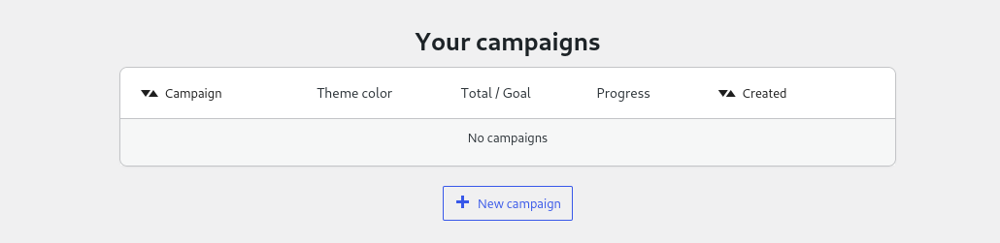
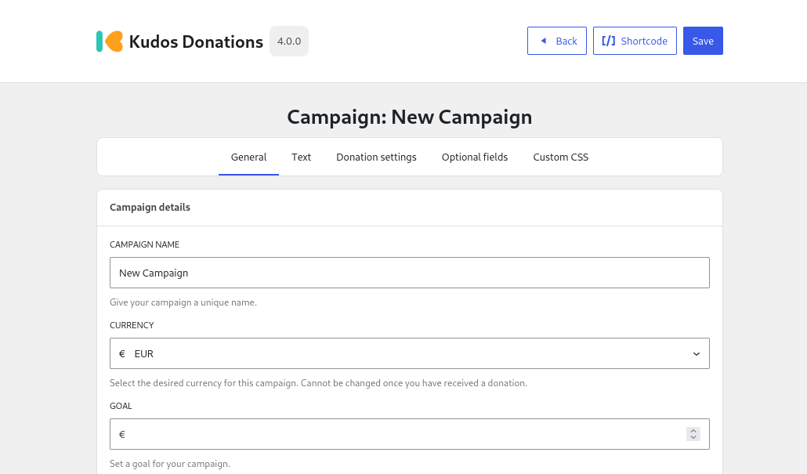
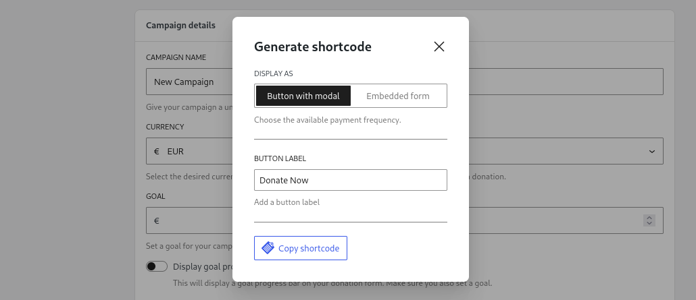

# Your First Campaign

Before you can start receiving donations you will need to create a campaign. Campaigns provide a way of organising your donations into specific projects or goals. Each campaign can be heavily customised to suit your requirements, however in this quick guide we will leave most things as their default setting. For many people, one campaign may be enough, however if you would like a way to split your donations into groups then multiple campaigns can make this much easier.

## Creating a campaign

To create your first campaign you will need to visit the **Campaigns** page located at **Donations > Campaigns**. You will then be greeted by the following screen:

From this page you will now want to click on the **New campaign** button located below the campaigns table. This will create a new campaign with all the **default** settings. For now, all we are going to do is give it a unique name under the **Campaign name** option. Once you are done, click the **Save** button located in the header.

## Placing the form on your website

In order to place the Kudos Donations form on your website you have two main options:

- **Shortcode** - older method and therefore better support on older websites/themes
- **Block** (recommended) - newer but requires theme support

Chose one of the two methods for now (if unsure follow the shortcode instructions). Regardless of which method you use, the same features are available on both.

### Shortcode

Shortcodes are the older method but have more support on older websites and themes. Shortcodes look like this:

``[kudos campaign_id=3]``

These can be placed anywhere on your posts and pages and will be converted to a Kudos Donations form for you visitors.

Rather than typing out the shortcode manually, you can click on the **Shortcode** button at the top of your campaign. This will open a pop-up where you can configure the shortcode. Let's leave everything as default for now and just click the **Copy shortcode** button at the bottom of the pop-up.

Now go to the Pages/Posts menu and edit the desired page. Then place the cursor in the editor where you would like to place the Kudos Donations form and paste the shortcode. Now save the page and your donate button should be visible when you visit it.

### Blocks

Blocks are the newer way of adding custom content to your posts/pages/widget area etc. If you have access to the [WordPress Block Editor](https://wordpress.org/documentation/article/wordpress-block-editor/) on your website then you can use Blocks.

To get started, go to the Pages/Posts menu and edit the desired page. Then place the cursor in the editor where you would like to place the Kudos Donations form. Click on the **➕** icon that appears and search for **Kudos Donations** and select it.

Now choose the campaign you just created on the sidebar on the right hand side. That's it, the **Donate Now** button should appear and all you need to do now is click save.

## Next step

That was a quick overview of getting up and running with your first campaigns, however you will probably want to customize certain aspects of your campaign from the defaults.