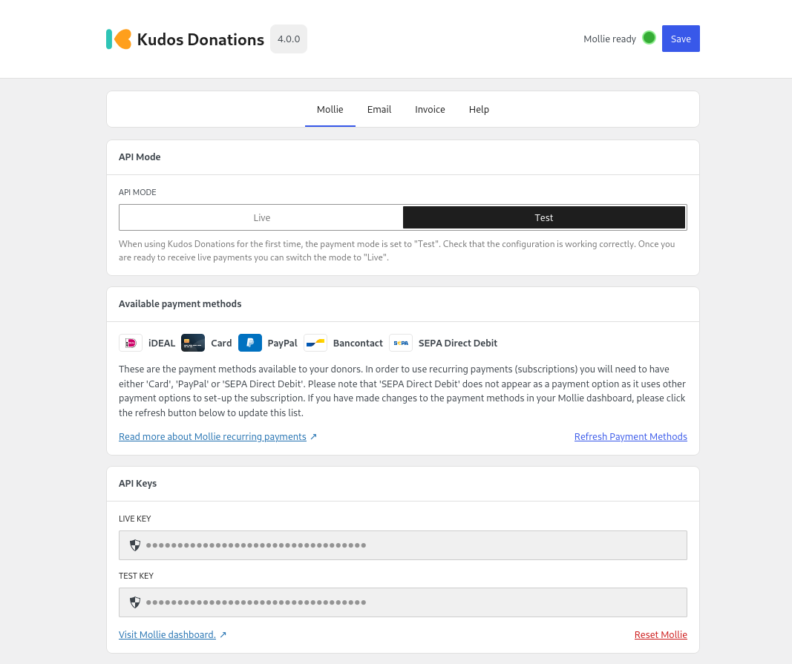

# Payment Provider

Once you have [installed](./install.md) and activated Kudos Donations, the next step is to enable a payment provider. At the moment we only support Mollie, however we are planning on adding more in the future.

---

## Mollie

:::tip

You can get your Mollie API keys by visiting [this page](https://mollie.com/dashboard/developers/api-keys).

:::

Visit the new **Donations** menu in the WordPress admin, you will be greeted by a welcome guide which will help you to get up and running. The main thing that you will need to complete here is to enter your **Mollie API keys** so that Kudos Donations can communicate with your Mollie account. You will need both your **test** and **live** keys. 

### Recurring payments
If you want to enable subscription payments you will need to activate one of the following payment methods in your Mollie account:

- SEPA direct debit
- Credit card
- Paypal

:::info

For more information about recurring payments with Mollie please visit [this page](https://help.mollie.com/hc/en-us/articles/214072489-How-do-I-use-Mollie-Recurring).

:::

### Next step
Once your keys have been entered and verified, Kudos Donations will indicate that Mollie is connected and you will be ready to create your first campaign.