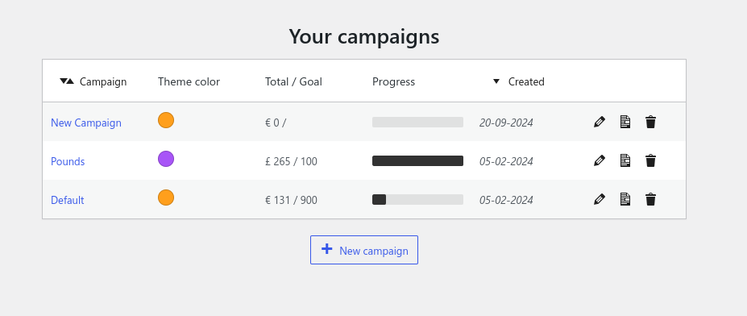
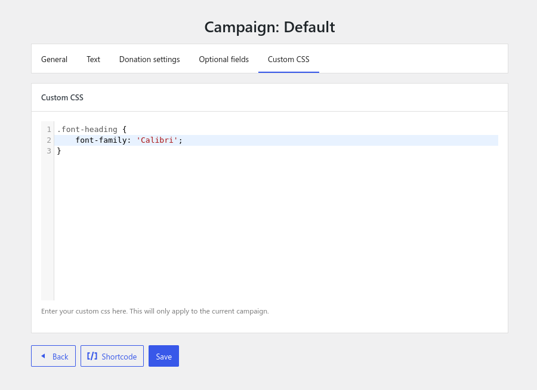
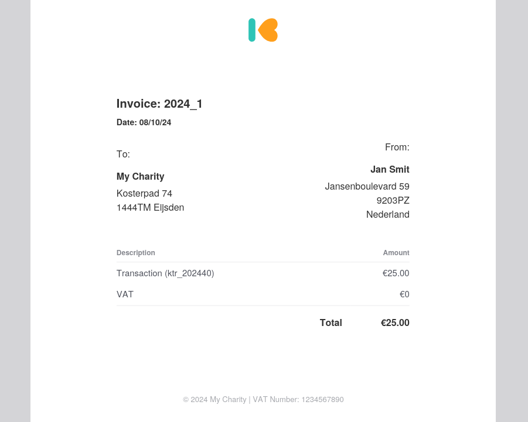
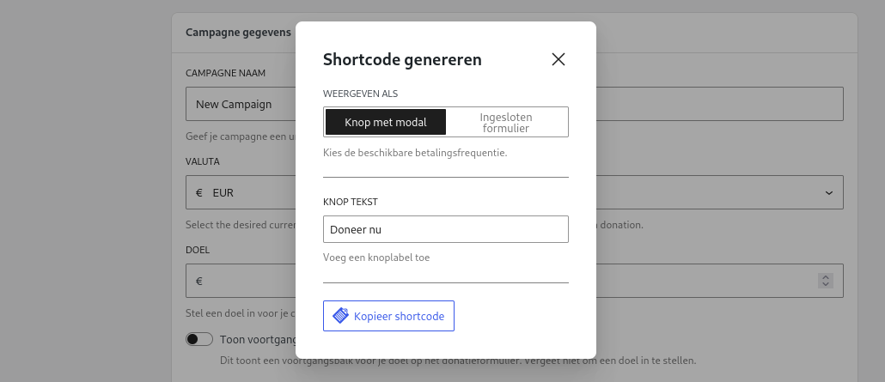
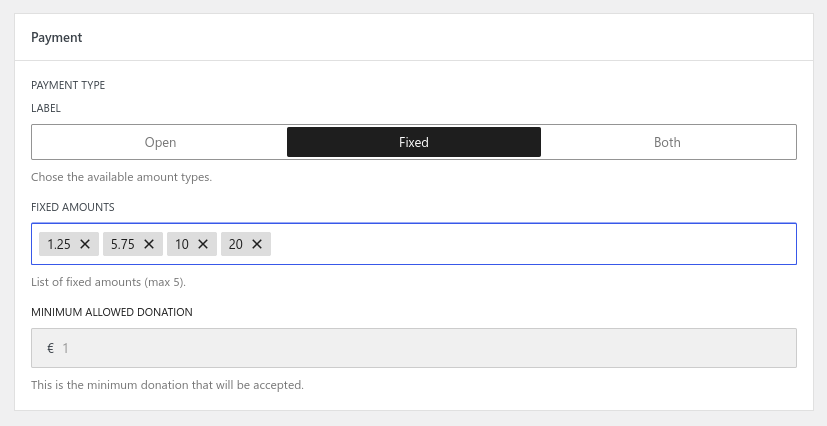

# Wijzigingen in v4.0.0

## Introductie

Versie 4.0.0 is een grote upgrade voor Kudos Donations. De plugin is volledig opnieuw opgebouwd en bevat een aantal belangrijke wijzigingen en verbeteringen ten opzichte van de 3.x-versies.

De meest opvallende wijzigingen zijn dat de meeste instellingen nu per campagne worden ingesteld (in plaats van globaal) en dat de front-end van de plugin nu in een apart frame wordt weergegeven met React.

:::warning

Als je aanpassingen hebt gedaan aan Kudos Donations met CSS, dan moeten deze opnieuw geconfigureerd worden. Lees [hier](#react-front-end) voor meer informatie.

:::

:::info

**Ontwikkelaars**: Alle entiteiten (Transacties, Campagnes, Donateurs, etc.) zijn nu **Custom Post Types** in plaats van aangepaste tabellen/opties. Dit betekent dat ze beter integreren met externe plugins (bijv. Export- of Back-up-plugins).

:::

## Overzicht

Hier is een kort overzicht van de belangrijkste wijzigingen:

* Nieuwe beheerderspagina voor campagnes met opties om campagnes aan te maken, te bewerken, te dupliceren en te verwijderen
* De meeste instellingen kunnen nu per campagne worden geconfigureerd in plaats van globaal
* Volledige herschrijving van de front-end rendering naar React
* Minder conflicten met andere thema’s en plugins door gebruik van de Shadow DOM
* Ondersteuning voor meerdere valuta’s
* Verbeterde instellingenpagina met een frissere look & feel
* Makkelijk shortcodes genereren per campagne via een handige pop-up
* Nieuwe minimale donatie-instelling
* Mogelijkheid voor gedeeltelijke donatiebedragen (bijv. €1,5)
* E-mail "van naam"-header kan nu worden ingesteld en standaard ingesteld op de websitennaam
* Wachtwoorden en API-sleutels zijn nu versleuteld

## Campagnes

In versie 3.x vond je de campagnes onder het menu **Donaties > Instellingen** op een aparte tab voor campagnes. Nu is er een apart menu **Donaties > Campagnes**, waar je een overzicht van je campagnes krijgt en ze kunt aanmaken, verwijderen, dupliceren en bewerken.

Naast de aanpassingen die al mogelijk waren in de 3.x-versies, kun je nu ook de meeste andere instellingen per campagne aanpassen (themakleur, retour-URL, retourbericht, etc.), waardoor je meer controle hebt over elke campagne.

Zodra je je e-mail- en verkopersinstellingen hebt geconfigureerd, is de **Campagnes**-pagina de plek waar je het meeste tijd zult besteden aan het instellen van Kudos Donations.

## React Front-End

Om conflicten met andere thema’s en plugins te minimaliseren, worden de Kudos Donations-knop en het donatieformulier nu weergegeven via React in een eigen frame (Shadow DOM). Dit betekent dat de CSS en JavaScript van andere thema’s of plugins niet langer eenvoudig conflicten kunnen veroorzaken waardoor Kudos Donations er verkeerd uitziet of niet goed werkt.

Een gevolg van deze nieuwe methode is dat als je CSS-aanpassingen hebt gedaan aan het uiterlijk van Kudos Donations, deze niet meer werken. Om Kudos Donations aan te passen, moet je nu je aangepaste CSS schrijven in het tabblad **Aangepaste CSS** onder de campagne waarvoor je het wilt gebruiken.

Een voordeel hiervan is dat je nu eenvoudig het uiterlijk van Kudos Donations per campagne kunt aanpassen. Omdat er minder kans is op conflicten met andere plugins en thema’s, kunnen de CSS-regels eenvoudiger zijn.

## PDF Facturen

Kudos Donations kan nu PDF-facturen genereren voor geslaagde donaties. Je kunt je adres en btw-nummer toevoegen onder **Donaties > Instellingen > Factuur**, en deze informatie wordt automatisch toegevoegd aan elke factuur.

Als je de optie **E-mail ontvangstbewijzen verzenden** hebt ingeschakeld (**Donaties > Instellingen > E-mail**), wordt een kopie van deze factuur automatisch als bijlage meegestuurd in de e-mail naar de donateur.

## Meerdere Valuta’s

In versie 3.x waren alle transacties in euro’s (€), maar het is nu mogelijk om de gewenste valuta te selecteren bij het aanmaken van een campagne. De lijst met beschikbare valuta’s wordt momenteel bepaald door de valuta’s die worden [ondersteund door Mollie](https://docs.mollie.com/docs/multicurrency).

Om technische redenen is het niet meer mogelijk om de valuta te wijzigen zodra er een donatie is ontvangen voor de campagne.

## Shortcode Pop-up

Als je nog steeds shortcodes gebruikt (in plaats van blokken), is er een handige nieuwe functie: de shortcode-generator knop. Deze is toegankelijk vanuit het bewerkingsscherm van een campagne. Met een paar eenvoudige opties kun je je shortcode eenvoudig configureren en genereren zonder deze handmatig in te typen.

## Gedeeltelijke Donaties

Voorheen kon je alleen donaties doen in hele bedragen (1, 5, 10, 20, etc.), maar het is nu mogelijk om donaties in kleinere eenheden te doen (1,5, 5,2, 10,6). Dit geldt zowel voor vaste als open waarde-donaties.

## Versleutelde Wachtwoorden & API-sleutels

Het versleutelen van je wachtwoorden en API-sleutels is de beste manier om je gevoelige gegevens te beschermen tegen aanvallers. Door deze gegevens te versleutelen, is het niet mogelijk voor iemand met toegang tot de WordPress-database om de originele wachtwoorden of API-sleutels te bekijken. Momenteel geldt dit voor zowel Mollie API-sleutels als het SMTP-wachtwoord.
