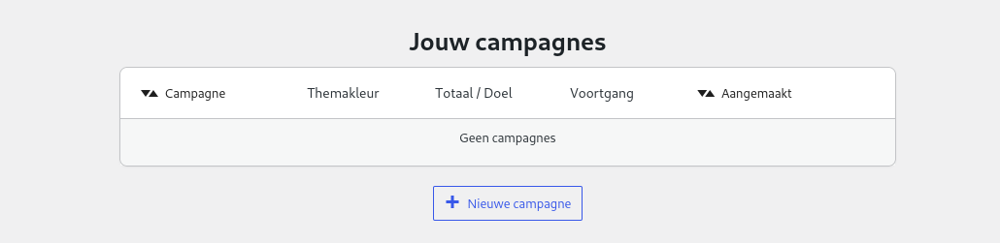
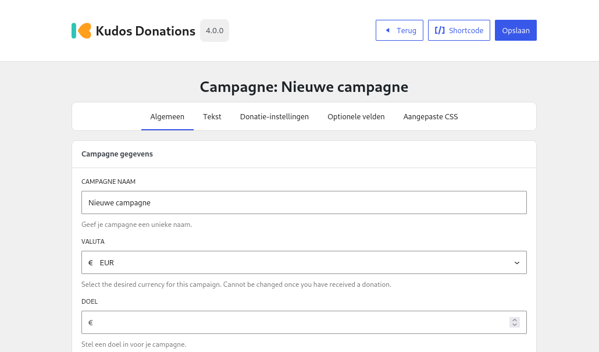
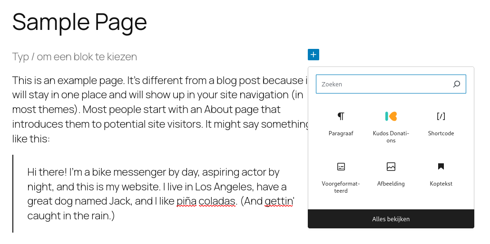

# Je eerste campagne

Voordat je donaties kunt ontvangen, moet je een campagne aanmaken. Campagnes bieden een manier om je donaties te organiseren in specifieke projecten of doelen. Elke campagne kan uitgebreid worden aangepast aan jouw wensen, maar in deze snelle handleiding laten we de meeste instellingen op hun standaardwaarde. Voor veel mensen is één campagne voldoende, maar als je je donaties wilt opdelen in groepen, kunnen meerdere campagnes dit een stuk eenvoudiger maken.

## Een campagne aanmaken

Om je eerste campagne te maken, ga je naar de pagina **Campagnes** onder **Donaties > Campagnes**. Je wordt dan begroet door het volgende scherm:

Op deze pagina klik je op de knop **Nieuwe campagne**, onder de campagnetabel. Hiermee maak je een nieuwe campagne met alle **standaard** instellingen. Voor nu gaan we alleen een unieke naam invoeren bij de optie **Campagnenaam**. Als je klaar bent, klik je op de knop **Opslaan** in de header.

## Het formulier op je website plaatsen

Om het Kudos Donations-formulier op je website te plaatsen, heb je twee opties:

- **Shortcode** – de oudere methode, beter compatibel met oudere websites en thema's.
- **Blok** (aanbevolen) – de nieuwere methode, vereist thema-ondersteuning.

Kies een van de twee methoden voor nu (als je twijfelt, volg de shortcode-instructies). Beide methoden bieden dezelfde functies.

### Shortcode

Shortcodes zijn de oudere methode, maar worden beter ondersteund op oudere websites en thema’s. Een shortcode ziet er als volgt uit:

``[kudos campaign_id=3]``

Deze kun je overal in je berichten en pagina’s plaatsen, waarna het automatisch wordt omgezet naar een Kudos Donations-formulier voor je bezoekers.

In plaats van de shortcode handmatig in te typen, kun je op de knop **Shortcode** bovenaan je campagnepagina klikken. Dit opent een pop-up waarin je de shortcode kunt configureren. Laat alles op de standaardinstellingen staan en klik op de knop **Kopieer shortcode** onderaan de pop-up.

Ga nu naar het **Pagina’s/Berichten** menu en bewerk de gewenste pagina. Plaats vervolgens de cursor in de editor op de plek waar je het Kudos Donations-formulier wilt tonen en plak de shortcode. Sla de pagina op en je donatieknop zou nu zichtbaar moeten zijn wanneer je de pagina bezoekt.

### Blokken

Blokken zijn de nieuwere manier om aangepaste inhoud toe te voegen aan je berichten/pagina’s/widgetgebieden, etc. Als je toegang hebt tot de [WordPress Blok Editor](https://wordpress.org/documentation/article/wordpress-block-editor/) op je website, dan kun je Blokken gebruiken.

Om te beginnen, ga naar het **Pagina’s/Berichten** menu en bewerk de gewenste pagina. Plaats de cursor in de editor op de plek waar je het Kudos Donations-formulier wilt hebben. Klik op het **➕** icoon en zoek naar **Kudos Donations** en selecteer het.

Kies nu de campagne die je zojuist hebt aangemaakt in de zijbalk aan de rechterkant. Dat is alles! De **Doneer Nu**-knop zou nu zichtbaar moeten zijn en je hoeft alleen nog maar op opslaan te klikken.

## Volgende stap

Dit was een snelle introductie om je eerste campagne op te zetten, maar je wilt waarschijnlijk bepaalde aspecten van je campagne aanpassen aan je wensen.
