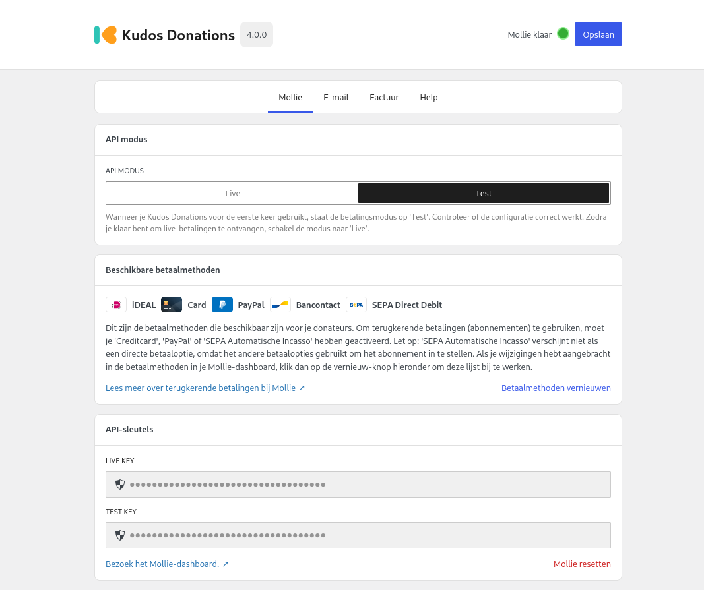

# Betaalprovider

Zodra je Kudos Donations hebt [geïnstalleerd](./install.md) en geactiveerd, is de volgende stap het inschakelen van een betaalprovider. Op dit moment ondersteunen we alleen Mollie, maar we zijn van plan om in de toekomst meer opties toe te voegen.

---

## Mollie

:::tip

Je kunt je Mollie API-sleutels ophalen via [deze pagina](https://mollie.com/dashboard/developers/api-keys).

:::

Ga naar het nieuwe **Donaties**-menu in de WordPress-beheeromgeving. Je wordt begroet door een welkomstgids die je helpt om snel aan de slag te gaan. Het belangrijkste dat je hier moet doen, is je **Mollie API-sleutels** invoeren, zodat Kudos Donations kan communiceren met je Mollie-account. Je hebt zowel je **test** als **live** sleutels nodig.

### Terugkerende betalingen
Als je abonnementsbetalingen wilt inschakelen, moet je een van de volgende betaalmethoden activeren in je Mollie-account:

- SEPA automatische incasso
- Creditcard
- PayPal

:::info

Voor meer informatie over terugkerende betalingen met Mollie, bekijk [deze pagina](https://help.mollie.com/hc/nl/articles/214072489-Hoe-gebruik-ik-Mollie-Recurring).

:::

### Volgende stap
Zodra je API-sleutels zijn ingevoerd en geverifieerd, geeft Kudos Donations aan dat Mollie is verbonden en kun je je eerste campagne aanmaken.
